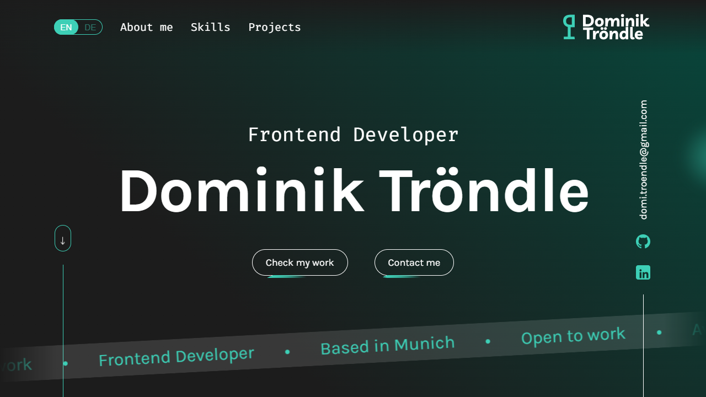

# Portfolio Website

A personal portfolio website built with **Angular** and **TypeScript**, focused on clean UI architecture, reusable components, and a structured frontend workflow.

The project showcases selected work, technical skills, and development approach, with an emphasis on maintainable code and user-centered design.

---

## Live Demo

[View Portfolio](https://dominik-troendle.de)

---

## About the Project

This portfolio was developed to present my work as a frontend developer in a clear and structured way.
It combines a modern UI with a modular codebase and dynamic content handling.

The application follows a component-based architecture and integrates external data sources to keep content maintainable and scalable.

---

## Features

* Component-based architecture using Angular
* Dynamic content rendering via structured data (Firestore)
* Multi-language support (German / English)
* Smooth scrolling and section-based navigation
* Interactive UI with animations (GSAP)
* Responsive design across devices

---

## Tech Stack

* **Angular 17**
* **TypeScript**
* **SCSS**
* **Firebase / Firestore**
* **GSAP (ScrollTrigger)**

---

## Getting Started

### Installation

```bash
npm install
```

### Run development server

```bash
ng serve
```

---

## Project Structure

```text
src/
├── app/
│   ├── components/      # Reusable layout components
│   ├── main-content/    # Wrapper component for main content
│   ├── services/        # Shared services for data and storage handling
│   ├── shared/          # Shared layout components
│   └── styles/          # SCSS utilities
├── assets/              # Static assets
```

---

## Key Concepts

* **Modular component design** for scalability and reuse
* **Separation of concerns** (UI, logic, data)
* **Dynamic data-driven rendering** via Firestore
* **Routing-based navigation with deep linking**
* **Animation-driven UX enhancements**

---

## Author

Dominik Tröndle
Frontend Developer based in Munich

---

## Preview

